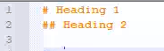
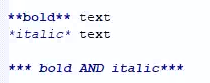
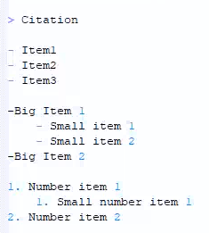
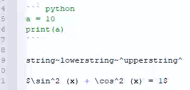
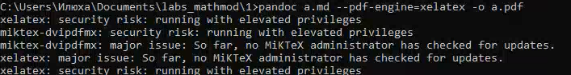
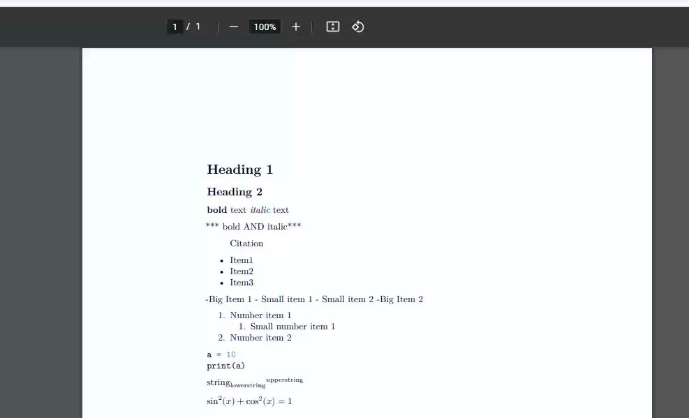
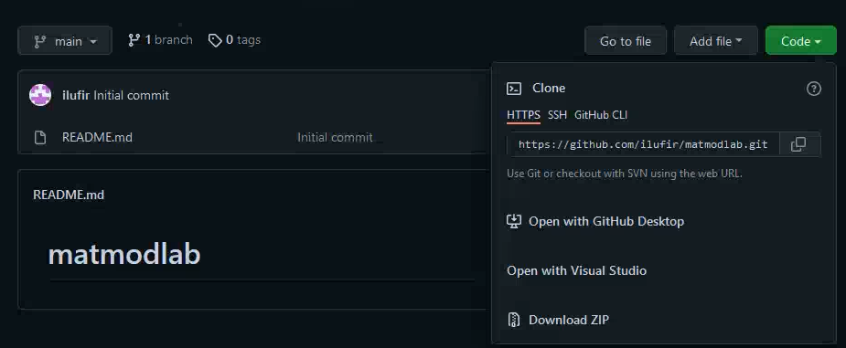
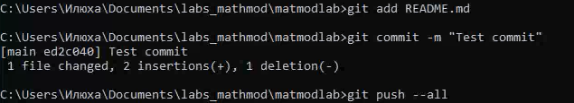
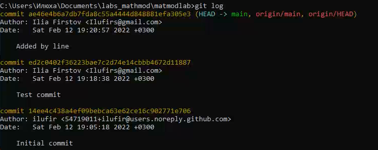
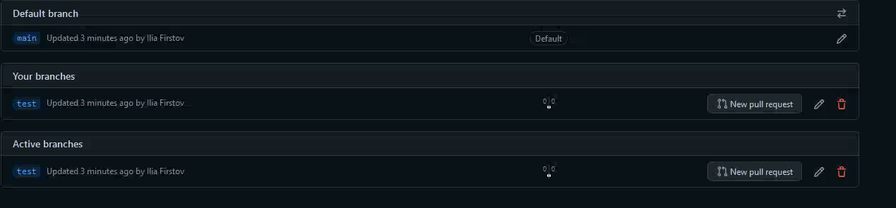

<h1 align="center">

РОССИЙСКИЙ УНИВЕРСИТЕТ ДРУЖБЫ НАРОДОВ 

Факультет физико-математических и естественных наук  

Кафедра прикладной информатики и теории вероятностей

ПРЕЗЕНТАЦИЯ ПО ЛАБОРАТОРНОЙ РАБОТЕ №1
  
<h2 align="right">

дисциплина: Математическое моделирование

Преподователь: Кулябов Дмитрий Сергеевич

Студент: Фирстов Илья Валерьевич

Группа: НФИбд-02-19
  
  
<h1 align="center">

МОСКВА

2023 г.
</h1>

# **Прагматика выполнения лабораторной работы**

- знакомство с системой контроля версий Git и markdown

# **Цель работы**

Создать документ в markdown; попрактиковаться в работе с системой git

# Задачи выполнения лабораторной работы

# Теоретическое введение

Markdown (произносится маркдаун) — облегчённый язык разметки, созданный с целью обозначения форматирования в простом тексте, с максимальным сохранением его читаемости человеком, и пригодный для машинного преобразования в языки для продвинутых публикаций (HTML, Rich Text и других). 

Git (произносится «гит») — распределённая система управления версиями. Проект был создан Линусом Торвальдсом для управления разработкой ядра Linux

# **Выполнение лабораторной работы**

**_Часть 1 - Markdown_**

Создал документ a.md. Для начала добавил заголовки при помощи тэгов # и ##(рис. [-@fig:001])

{ #fig:001 width=70% }

Затем добавил надписи с жирным и курсивным начертанием текста при помощи * (рис. [-@fig:002])

{ #fig:002 width=70% }

После добавления цитаты при помощи >, я добавил несколько разных списков - пронумерованные и обычные, и с вложенными списками(рис. [-@fig:003])

{ #fig:003 width=70% }

Затем в документ был добавлен код на языке python, примеры использования верхних и нижних индексов и формула(рис. [-@fig:004])

{ #fig:004 width=70% }

После этого при помощи утилиты pandoc файл md был преобразован в pdf(рис. [-@fig:005])

{ #fig:005 width=70% }

Полученный файл был открыт и содержал все нужные элементы(рис. [-@fig:006])

{ #fig:006 width=70% }

**_Часть 2 - git_**

На ресурсе github я создал репозиторий для загрузки лабораторных работ(рис. [-@fig:007])

{ #fig:007 width=70% }

Затем, склонировав его себе на компьютер, я изменил файл readme и закоммитил его в репозиторий(рис. [-@fig:010])

{ #fig:010 width=70% }

Это отразилось в логах - git status показывает все коммиты(рис. [-@fig:008])

{ #fig:008 width=70% }

Потом я создал новую ветку test(рис. [-@fig:009])

{ #fig:009 width=70% }

# Выводы

Я ознакомился с использованием языка разметки markdown и системы контроля версий git. На сервисе github создал репозиторий для загрузки лабораторных работ.
