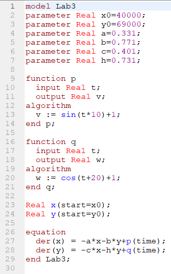
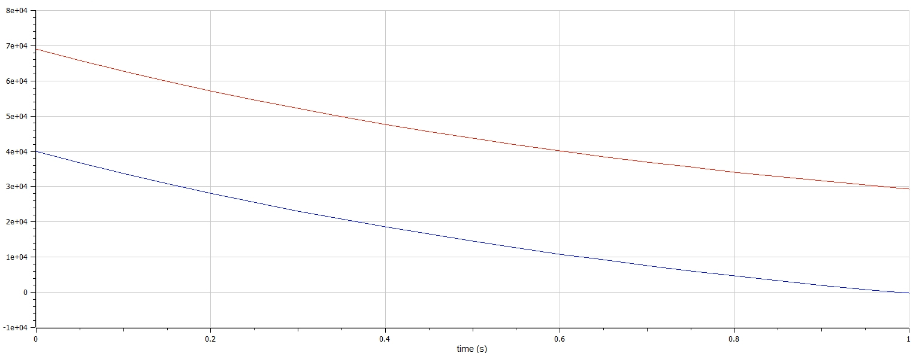

<h1 align="center">

РОССИЙСКИЙ УНИВЕРСИТЕТ ДРУЖБЫ НАРОДОВ 

Факультет физико-математических и естественных наук  

Кафедра прикладной информатики и теории вероятностей

ПРЕЗЕНТАЦИЯ ПО ЛАБОРАТОРНОЙ РАБОТЕ №3
  
<h2 align="right">

дисциплина: Математическое моделирование

Преподователь: Кулябов Дмитрий Сергеевич

Студент: Серенко Данил Сергеевич

Группа: НФИбд-03-19
  
  
<h1 align="center">

МОСКВА

2023 г.
</h1>

# **Прагматика выполнения**

• Построение математической модели боевых действий

# **Цель работы**

Построение простейших моделей боевых действий – модели Ланчестера

# **Условия задачи**

**Вариант - 20**

Между страной Х и страной У идет война. Численность состава войск исчисляется от начала войны, и являются временными функциями x(t) и y(t). В начальный момент времени страна Х имеет армию численностью 40000 человек, а в распоряжении страны У армия численностью в 69000 человек. Для упрощения модели считаем, что коэффициенты
a, b, c, h постоянны. Также считаем P(t) и Q(t) непрерывные функции. Нужно построить графики изменения численности войск армии Х и армии У для
следующих случаев:

1. Модель боевых действий между регулярными войсками

# **Задачи работы**

Построить и проанализировать модель боевых действий между регулярными войсками

# **Результаты выполнения лабораторной работы** 

**_Построение модели боевых действий между регулярными войсками_**

Потери, не связанные с боевыми действиями, описывают члены a(t)x(t) и h(t)y(t), члены b(t)y(t) и c(t)x(t) отражают потери на поле боя. Коэффициенты b(t) и c(t) указывают на эффективность боевых действий со стороны у и х соответственно, a(t),h(t) - величины, характеризующие степень влияния различных факторов на потери. Функции P(t),Q(t) учитывают возможность подхода подкрепления к войскам Х и У в течение одного дня.

Для построения модели мы используем следующий скрипт:

В итоге получаем следующий график:

Мы видим, что армия страны X быстрее достигнет нуля, чем армия Y, следовательно страна X проиграет в войне.

# Выводы

Я научился выполнять построение модели боевых действий между регулярными войсками в OpenModelica.

# Список литературы

1. Кулябов, Д.С. - Модель боевых действий
