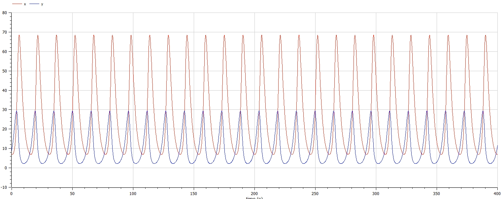
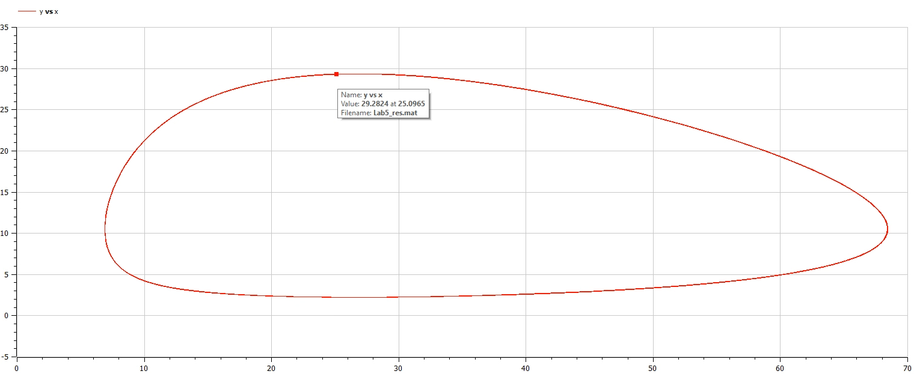

<h1 align="center">

РОССИЙСКИЙ УНИВЕРСИТЕТ ДРУЖБЫ НАРОДОВ 

Факультет физико-математических и естественных наук  

Кафедра прикладной информатики и теории вероятностей

ПРЕЗЕНТАЦИЯ ПО ЛАБОРАТОРНОЙ РАБОТЕ №5
  
<h2 align="right">

дисциплина: Математическое моделирование

Преподователь: Кулябов Дмитрий Сергеевич

Студент: Фирстов Илья Валерьевич

Группа: НФИбд-02-19
  
  
<h1 align="center">

МОСКВА

2023 г.
</h1>

# **Прагматика выполнения лабораторной работы**

- знакомство с моделью Лотки-Вольтерры "хищник-жертва"
- работа с OpenModelica

# **Цель работы**

Построение модели Лотки-Вольтерры "хищник-жертва"

# Задачи выполнения лабораторной работы

Постройте график зависимости численности хищников от численности жертв,а также графики изменения численности хищников и численности жертв при следующих начальных условиях:

x0 = 7, y0 = 9 .

# **Выполнение лабораторной работы**

**_Построение модели Лотки-Вольтерры "хищник-жертва"_**

Чтобы построить фазовый портрет модели, я написал следующий код:

и получил фазовый портрет модели:

# Результаты выполнения лабораторной работы

- модель в OpenModelica
- графики для модели

# Выводы

После завершения данной лабораторной работы - я научился выполнять построение модели Лотки-Вольтерры "хищник-жертва" в OpenModelica.
