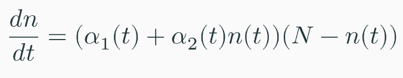
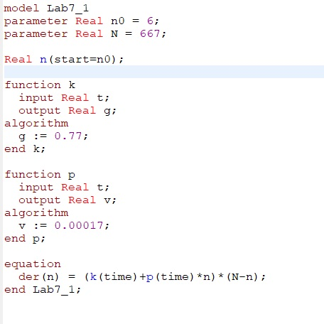
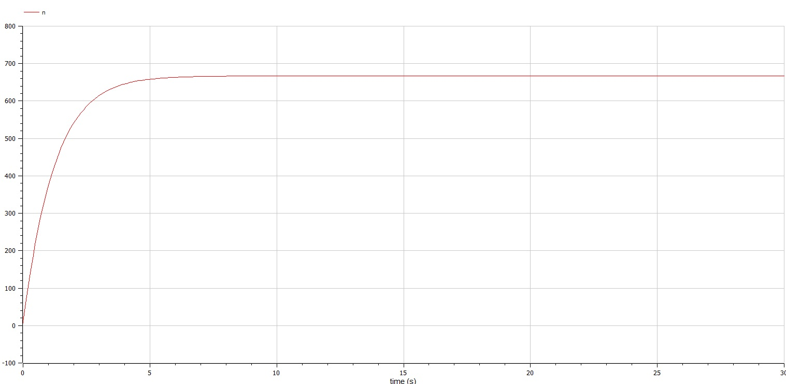
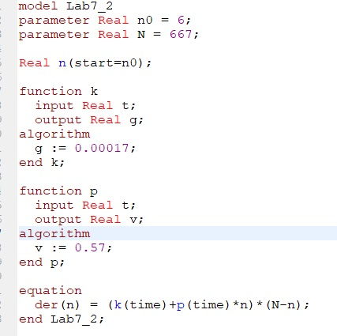
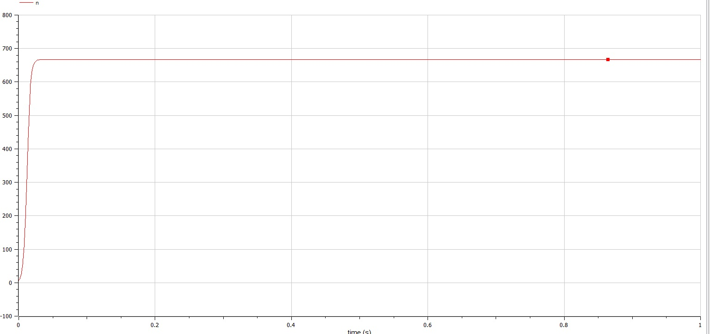
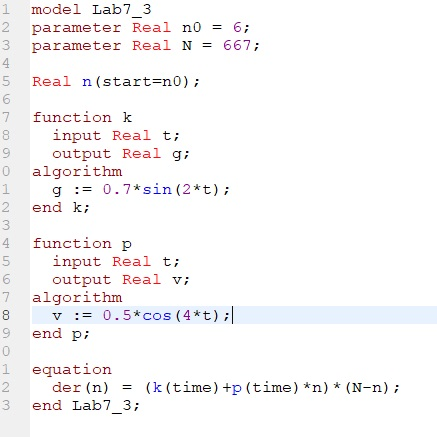
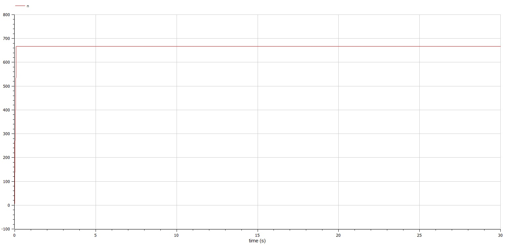

---
## Front matter
lang: ru-RU
title: 
author: |

institute: |

date: 

## Formatting
toc: false
slide_level: 2
theme: metropolis
header-includes: 

 - '\makeatletter'

 - '\makeatother'
aspectratio: 43
section-titles: true
---

<h1 align="center">

РОССИЙСКИЙ УНИВЕРСИТЕТ ДРУЖБЫ НАРОДОВ 

Факультет физико-математических и естественных наук  

Кафедра прикладной информатики и теории вероятностей

ПРЕЗЕНТАЦИЯ ПО ЛАБОРАТОРНОЙ РАБОТЕ №7
  
<h2 align="right">

дисциплина: Математическое моделирование

Преподователь: Кулябов Дмитрий Сергеевич

Студент: Фирстов Илья Валерьевич

Группа: НФИбд-02-19
  
  
<h1 align="center">

МОСКВА

2023 г.
</h1>

# Теоретическая справка

Организуется рекламная кампания нового товара или услуги. Необходимо,
чтобы прибыль будущих продаж с избытком покрывала издержки на рекламу.

Математическая модель описывается
следующим уравнением:

{ #fig:007 width=70% }

# Выполнение лабораторной работы

Ниже приведены шаги выполнения лабораторной работы, в соответствии с 13 вариантом из приведенного документа.

При выполнении я использовал общий шаблон кода, в котором изменял лишь функции, которые отличают частные случаи от общей модели.

Код 1 случая (рис. [-@fig:001])

{ #fig:001 width=70% }

График симуляции 1 случая (рис. [-@fig:002])

{ #fig:002 width=70% }

Код 2 случая (рис. [-@fig:003])

{ #fig:003 width=70% }

График симуляции 2 случая (рис. [-@fig:004])

{ #fig:004 width=70% }

Код 3 случая (рис. [-@fig:005])

{ #fig:005 width=70% }

График симуляции 3 случая(рис. [-@fig:006])

{ #fig:006 width=70% }
{ #fig:006 width=70% }

## {.standout}

