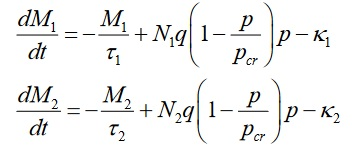
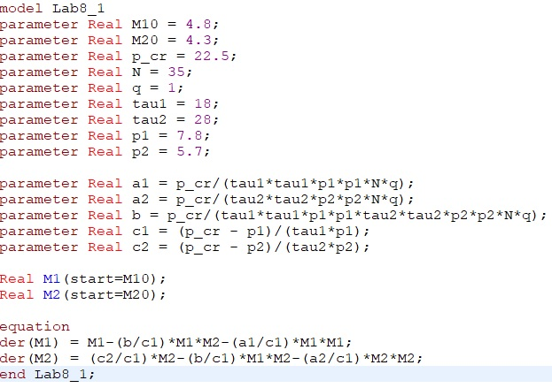
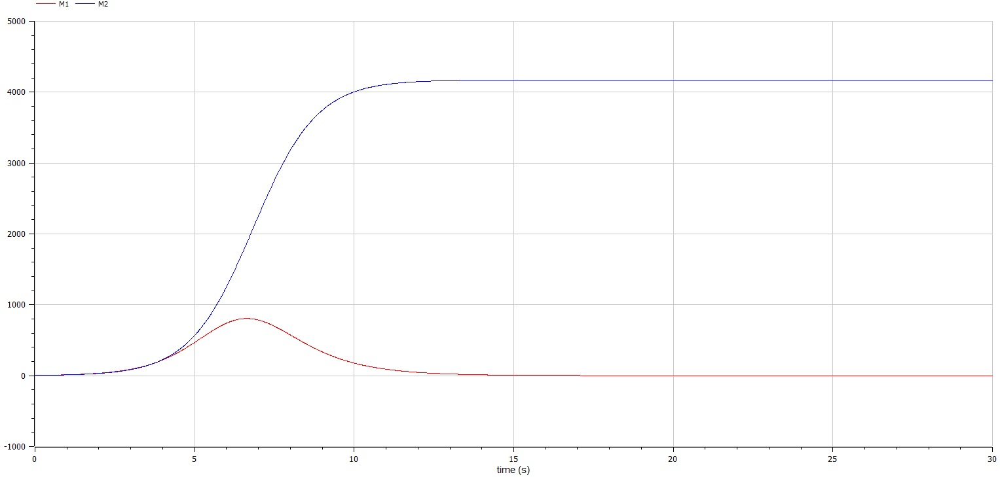
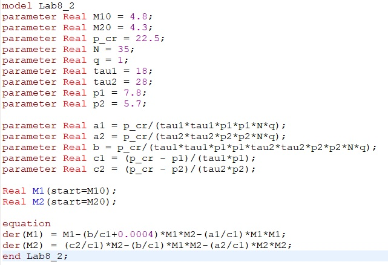

---
## Front matter
lang: ru-RU
title: 
author: |

institute: |

date: 

## Formatting
toc: false
slide_level: 2
theme: metropolis
header-includes: 

 - '\makeatletter'

 - '\makeatother'
aspectratio: 43
section-titles: true
---

<h1 align="center">

РОССИЙСКИЙ УНИВЕРСИТЕТ ДРУЖБЫ НАРОДОВ 

Факультет физико-математических и естественных наук  

Кафедра прикладной информатики и теории вероятностей

ПРЕЗЕНТАЦИЯ ПО ЛАБОРАТОРНОЙ РАБОТЕ №8
  
<h2 align="right">

дисциплина: Математическое моделирование

Преподователь: Кулябов Дмитрий Сергеевич

Студент: Фирстов Илья Валерьевич

Группа: НФИбд-02-19
  
  
<h1 align="center">

МОСКВА

2023 г.
</h1>

# Теоретическая справка

Рассмотрим две фирмы, производящие взаимозаменяемые товары
одинакового качества и находящиеся в одной рыночной нише. Последнее означает,
что у потребителей в этой нише нет априорных предпочтений, и они приобретут
тот или иной товар, не обращая внимания на знак фирмы.
Опишем модель следующим уравнением:

{ #fig:005 width=70% }

где индексы 1 и 2 относятся к первой и второй
фирме, соответственно. Величины N1 и N2 – числа потребителей, приобретших
товар первой и второй фирмы.

Первое состояниеM  устойчиво и соответствует стабильному
функционированию предприятия. Второе состояниеM  неустойчиво, так, что
приM M  оборотные средства падают (dM/dt < 0), то есть, фирма идет к
банкротству. По смыслуM  соответствует начальному капиталу, необходимому
для входа в рынок.
В обсуждаемой модели параметр δ всюду входит в сочетании с τ. Это значит,
что уменьшение доли оборотных средств, вкладываемых в производство,
эквивалентно удлинению производственного цикла. Поэтому мы в дальнейшем
положим: δ = 1, а параметр τ будем считать временем цикла, с учётом сказанного

# Выполнение лабораторной работы

Ниже приведены шаги выполнения лабораторной работы, в соответствии с 13 вариантом из приведенного документа.

При выполнении я использовал общий шаблон кода, в котором изменял лишь функции, которые отличают частные случаи от общей модели.

Код 1 случая (рис. [-@fig:001])

{ #fig:001 width=70% }

График симуляции 1 случая (рис. [-@fig:002])

{ #fig:002 width=70% }

Код 2 случая (рис. [-@fig:003])

{ #fig:003 width=70% }

График симуляции 2 случая (рис. [-@fig:004])

{ #fig:004 width=70% }

